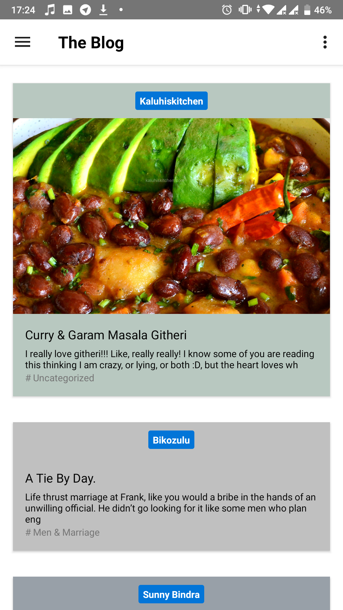
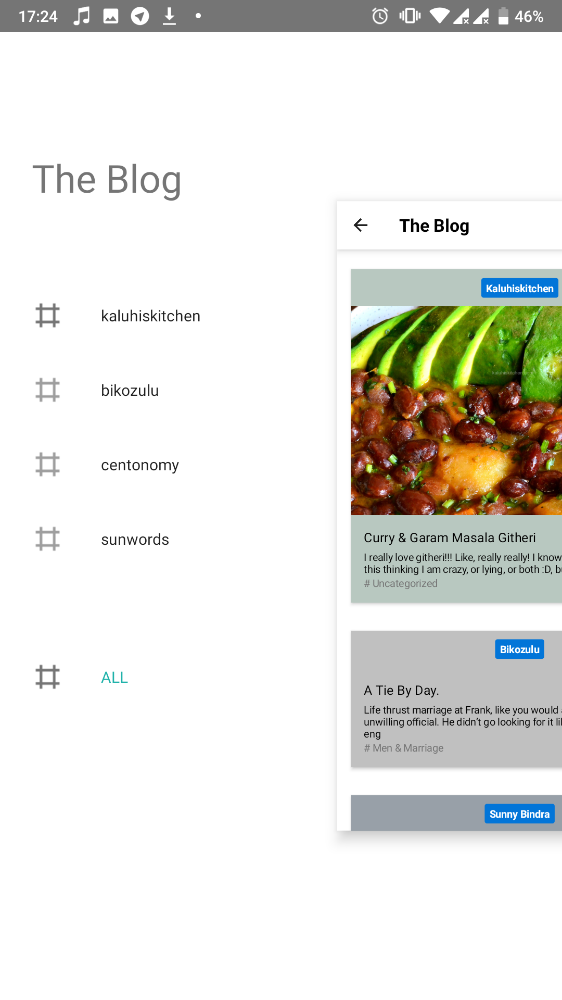

<h1>BlogApp<h2>
Easily turn your wordpress site into a mobile app.

<h2>Art<h2>

<h2> How to go about </h2>
<ul>
<li>Clone the app</h2>
<li>Use the existing Frgaments as template to create a new Frgaments</li>
<li>Change the String urlstring eg https://link.com/feed </li>
<li>you can change everything as you wish</li>
<ul>

